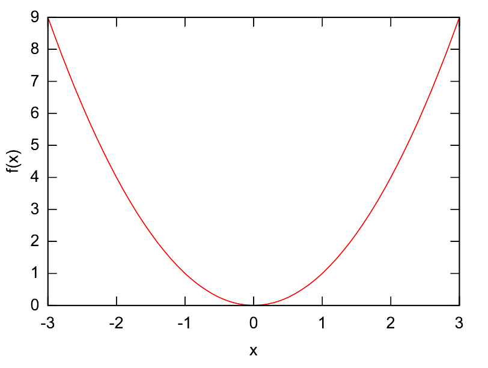



This program is, probably, a good example for using the `loop` loop. With it, you can set both the edges of the interval and the step directly in the units you need. Note that you can return to this task later after learning Raku _sequences_.

## Code

Here is the solution:

```raku
sub f($x) { $x² }

say "x\tf(x)";
loop (my $x = -3; $x <= 3; $x += 0.1) {
    say "$x\t{f($x)}";
}
```

🦋 Find the program in the file [function-table.raku](https://github.com/ash/raku-course/blob/master/exercises/functions/function-table.raku).

## Output

The program prints a long list of the x — f(x) table. A part of this output is shown here:

```console
$ raku exercises/functions/function-table.raku
-3	9
-2.9	8.41
-2.8	7.84

. . .

-0.2	0.04
-0.1	0.01
0	0
0.1	0.01
0.2	0.04

. . .

2.7	7.29
2.8	7.84
2.9	8.41
3	9
```

## Visualisation

It is wise to visualise the output with some external program, for example, Excel or gnuplot.




