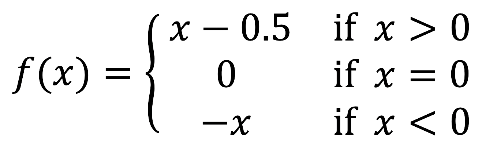



## Problem

Create a program that implements a function according to this definition:



Print the result of the function for the arguments `-2`, `0`, and `3`.


## Example

The program should print the following output:

```console
$ raku interval-function.raku
2
0
2.5
```

## Solution

✅ [See the solution](solution)


