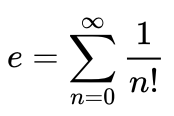



## Problem

Create a function that computes an approximate value of the mathematical constant _e_ using the following formula:



This function should allow being called in one of the forms:

1. The argument defines the number of items in the formula: `e-approx(10)`.
2. If no argument is passed, the sum contains 100 elements: `e-approx()`.

Print the results for both cases.

## Example

```console
$ raku the-value-of-e.raku
2.7182818
2.7182818284590453
```

## Solution

✅ [See the solution](solution)


