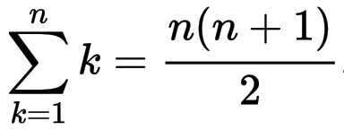



Чтобы посчитать сумму целых чисел от 1 до 100, можно сложить все числа в одном
длинном выражении. Или создать цикл (мы познакомимся с циклами в одной из
следующих глав). Но лучшее решение — это использовать широко известную
[формулу](https://ru.wikipedia.org/wiki/%D0%A0%D1%8F%D0%B4_%D0%B8%D0%B7_%D0%BD%D0%B0%D1%82%D1%83%D1%80%D0%B0%D0%BB%D1%8C%D0%BD%D1%8B%D1%85_%D1%87%D0%B8%D1%81%D0%B5%D0%BB).

<div class="formula"></div>

С помощью формулы решение сильно упрощается.

## Код

```raku
my $N = 100;
my $sum = $N * (1 + $N) / 2;
say "The sum of the numbers from 1 to $N is $sum.";
```

🦋 Вы можете найти исходный код в файле [sum1-100.raku](https://github.com/ash/raku-course/blob/master/exercises/essentials/numbers/sum1-100.raku).

## Вывод

```console
$ raku exercises/numbers/sum1-100.raku 
The sum of the numbers from 1 to 100 is 5050.
```



